# 家有糖人 需求规格说明书

> 产品名：家有糖人
> 版本：v0.3（已确认）
> 编写时间：2026-04-29
> 适用范围：家庭内部使用，不对外发行

## 1. 文档目的

本文档定义"家有糖人"的功能边界、信息架构、页面与流程。本产品基于已有竞品调研（见 `血糖记事本小程序需求说明.md`）进行**大幅瘦身**，仅保留家庭照护场景下真正会被反复使用的功能。

PRD 内决策按以下顺序对齐：先明确产品形态 → 锁定用户角色 → 圈定首版功能边界 → 描绘页面与流程 → 定义视觉规范。

第 6 节每个页面均附**高保真界面原型截图**（`assets/家有糖人/Pxx-XX.png`）。可点击的 HTML 原型见 `mockups/index.html`，所有 14 个页面并排可对照查看。

## 2. 产品定位

**一句话定义：一家人协作记录爸爸血糖的微信小程序。**

- 服务对象不是"糖尿病患者本人"，而是**整个家庭**。
- 核心病人（爸爸）是**被记录对象**，不一定是主要操作者。
- 家庭成员（女儿/儿子/老伴等）是**主要操作者**，他们在帮老人量血糖时顺手记录。
- 数据是**全家共享**的同一份，不做多账号切换。

这与原"血糖记事本"最大的区别是：
- 原产品默认是**患者本人在管理自己**，亲友管理是辅助功能。
- 本产品默认是**多个家庭成员协作记录一个人**，所以"是谁记的"必须显性可见。

## 3. 与原产品的范围差异

| 模块 | 原产品 | 本产品 | 备注 |
| --- | --- | --- | --- |
| 血糖记录列表 | 有 | **有** | 核心 |
| 新增血糖记录 | 多步表单 | **单页一屏录入** | 中老年友好 |
| 时段标签 | 有 | **有** | 复用 |
| 颜色分级 | 有 | **有** | 复用 |
| 按天矩阵 | 有 | **有** | 核心分析视图 |
| 趋势图表 | 有 | **有** | 核心分析视图 |
| 周期报表 | 有 | **有** | 核心分析视图 |
| 自定义血糖标准 | 有 | **有** | 家庭级标准（不是个人级） |
| 单位切换 | 有 | **不做**，仅 mmol/L | 中国家庭场景下统一标准 |
| 血压记录 | 有 | 不做 |  |
| 血脂记录 | 有 | 不做 |  |
| 用药方案 | 有 | 不做（仅在记录中允许填备注） |  |
| 食物记录 / 运动记录 | 有 | 不做（仅在记录中允许填备注） |  |
| 高级搜索 | 有 | 不做（按日期/时段筛选即可） |  |
| AI 问询 | 有 | 不做 |  |
| 生成文件 / 导出 | 有 | **有**（CSV 导出，用于看医生） |  |
| 餐后测糖提醒 | 有 | 不做（首版砍掉） | 后续可加 |
| 亲友管理 | 邀请协同 | **有，简化为邀请码加入家庭** | 核心 |
| 关怀模式 | 有 | 不做（整个产品本身就是中老年友好） |  |
| 健康跟踪 | 有 | 不做 |  |

**首版只做 P0，把"全家协作记血糖"这一件事做扎实。**

## 4. 用户角色

只区分两个角色，权限按"管理 vs 记录查看"分级：

- **家庭管理员（Creator / Admin）**：创建家庭的人，自动成为唯一管理员。
  - 可改家庭名
  - 可查看并复制邀请码（用来邀请家人）
  - 可移除任意成员
  - 可解散整个家庭
  - 可修改家庭血糖标准
  - 也具备成员的全部能力（记录、查看、编辑/删除自己记的）

- **家庭成员（Member）**：通过邀请码加入家庭的人。
  - 可记录血糖
  - 可查看家庭全部血糖记录
  - 可编辑/删除**自己**记的，不可改别人记的
  - 可退出家庭
  - **看不到邀请码**，不可移除其他成员，不可改家庭名，不可改血糖标准

每个家庭有且仅有一个管理员，管理员不可转让（首版不做转让逻辑）。

患者本人不强制作为操作者，他可以根本不进小程序。

## 5. 信息架构

### 5.1 一级导航（底部 TabBar，3 个 Tab）

- **首页**：血糖记录流 + 快速新增
- **分析**：按天矩阵 / 趋势图 / 报表（顶部分段切换）
- **我的**：家庭管理 / 自定义标准 / 数据导出 / 关于

### 5.2 全部页面清单

| ID | 页面 | 入口 | 角色 |
| --- | --- | --- | --- |
| P01 | 首页 | TabBar | 全员 |
| P02 | 新增/编辑血糖记录（手动） | 首页主操作按钮 | 全员 |
| P02b | 新增血糖记录（一句话 AI 模式） | 首页 🎤 / P02 顶部切换 | 全员 |
| P03 | 记录详情 | 首页列表点击 | 全员 |
| P04 | 分析-按天矩阵 | TabBar / 顶部切换 | 全员 |
| P05 | 分析-趋势图 | 顶部切换 | 全员 |
| P06 | 分析-周期报表 | 顶部切换 | 全员 |
| P07 | 我的 | TabBar | 全员 |
| P08 | 家庭管理（管理员视图） | 我的 | 管理员 |
| P08b | 家庭管理（成员视图） | 我的 | 成员 |
| P09 | 加入家庭（输入邀请码 / 创建家庭） | 首次进入 / 我的 | 未加入家庭者 |
| P10 | 自定义血糖标准 | 我的 | 管理员可改 / 成员只读 |
| P11 | 数据导出 | 我的 | 全员 |
| P12 | 关于 | 我的 | 全员 |

## 6. 核心页面与功能

### 6.1 P01 首页 — 血糖记录流

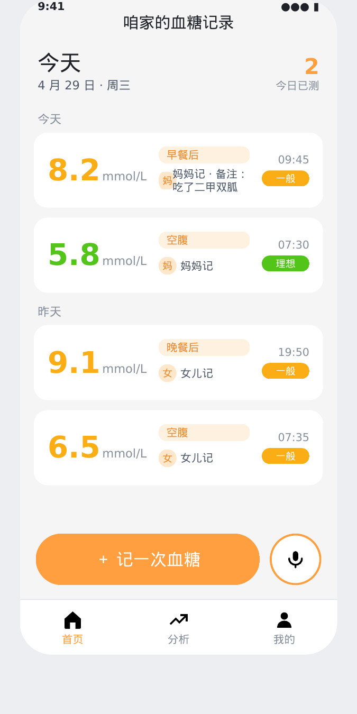

**页面职责**：让任何家人打开就能看到爸爸最近的血糖数据，颜色直观判断状态，一键开始新增。

可见信息：
- 顶部欢迎语：`{家庭名}的血糖记录` + 今日已测次数
- 倒序时间流，每条记录显示：
  - 大数字血糖值（按颜色分级）
  - 时段标签（空腹/餐后等）
  - 测量时间（今天/昨天/具体日期）
  - 记录人头像 + 昵称（"女儿 12:30 记录"）
  - 备注前 20 字（如有）
- 底部悬浮主操作区：长按钮"+ 记一次血糖" + 圆形麦克风按钮（一句话快记入口）

交互规则：
- 长按某条记录 → 显示删除/编辑（仅自己记的可操作）
- 下拉刷新拉取最新数据
- 列表底部"加载更多"按钮，分页加载
- 点击 🎤 直接进入 P02b 一句话模式
- 点击主按钮进入 P02 手动模式

### 6.2 P02 新增/编辑血糖记录（手动模式）

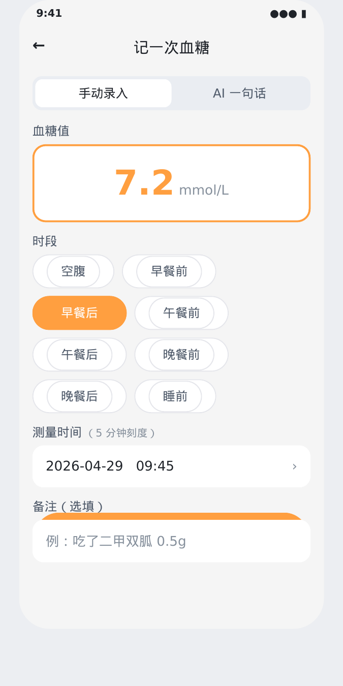

**页面职责**：3 秒内完成一条记录的录入。

页面顶部分段切换：`✋ 手动 | 🤖 一句话`，默认手动。切到一句话即跳转 P02b。

字段：
- **血糖值**（必填）：大号数字键盘，单位固定 mmol/L
- **时段**（必填）：8 个标签横排可选 — 空腹 / 早餐前 / 早餐后 / 午餐前 / 午餐后 / 晚餐前 / 晚餐后 / 睡前
- **测量时间**（必填）：默认现在，**按 5 分钟刻度选择**（不到分钟级精度，时间选择器跳格 00/05/10/15…/55）
- **备注**（选填）：单行文本框，例如"吃了二甲双胍 0.5g"

底部一个大保存按钮。保存后回首页，新记录置顶高亮 1 秒。

### 6.2b P02b 一句话快记（AI 模式）

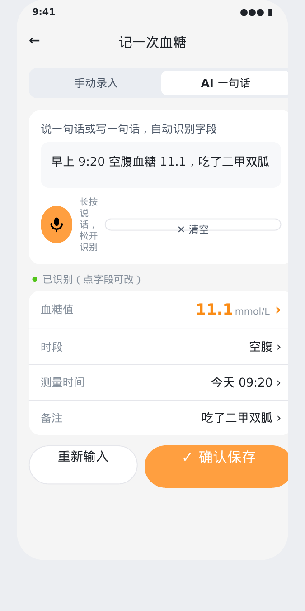

**页面职责**：让家人不用一个个填字段，说一句话就能识别出整条记录，确认后保存。

页面结构：
1. 顶部分段切换：`✋ 手动 | 🤖 一句话`，默认停留在一句话。
2. 输入区：
   - 多行文本框，placeholder 提示："试试说：早上 9:20 空腹血糖 11.1，吃了二甲双胍"
   - 圆形大麦克风按钮，**长按说话、松开识别**（语音转文字直接填入文本框）
   - 文本框右侧有"✕ 清空"
3. 解析按钮：用户输入完成后点击「智能识别」。
4. 识别结果卡片：把识别出的字段以**只读高亮卡片**展示，每个字段下方有"修改"小链接：
   - 血糖值
   - 时段（如未明说，按测量时间推断 — 6-9 点空腹 / 9-11 早餐后 / 11-13 午餐前 / 13-15 午餐后 / 17-19 晚餐前 / 19-21 晚餐后 / 21-23 睡前。推断结果用斜体标注"推断"）
   - 测量时间（按 5 分钟刻度取整）
   - 备注
5. 缺字段提示：如关键字段未识别（血糖值/时段二选一缺失），顶部红色横条提示"未识别到血糖值，请补充或重新输入"，并禁用"确认保存"按钮。
6. 底部按钮：「确认保存」（蓝色高亮）+「重新输入」。

#### AI 解析能力边界

支持以下表述（含中文数字、混合写法）：
- 时间：`9:20`、`上午九点二十`、`刚才`、`半小时前`、`今早 7 点`
- 血糖值：`11.1`、`11 点 1`、`十一点一`、单独数字默认认作血糖
- 时段：`空腹` / `早餐后` / `午饭后` / `饭后两小时`（推断为最近一餐后）/ `睡前`
- 备注：单引号、双引号或冒号后的内容；或末尾未识别的中文短句

不支持（首版）：
- 多条记录一次输入（"早上 5.8 中午 8.3" 会只识别第一条）
- 跨日期：`昨天早上空腹 6.5` — 首版只支持当天，跨日提示用户切手动
- 单位换算 mg/dL（统一 mmol/L）

#### 保存流程

用户点「确认保存」后，系统按手动录入逻辑写入数据库，新记录回流首页时间流，标注"AI 录入"小图标以区分。

### 6.3 P03 记录详情

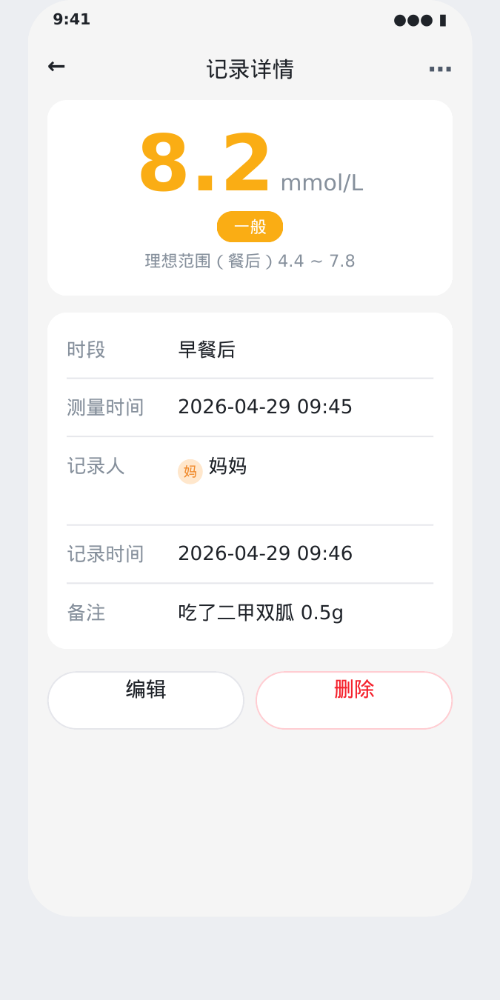

简单只读视图，显示完整字段 + 记录人 + 编辑/删除按钮（仅自己记的可见）。

### 6.4 P04 分析-按天矩阵

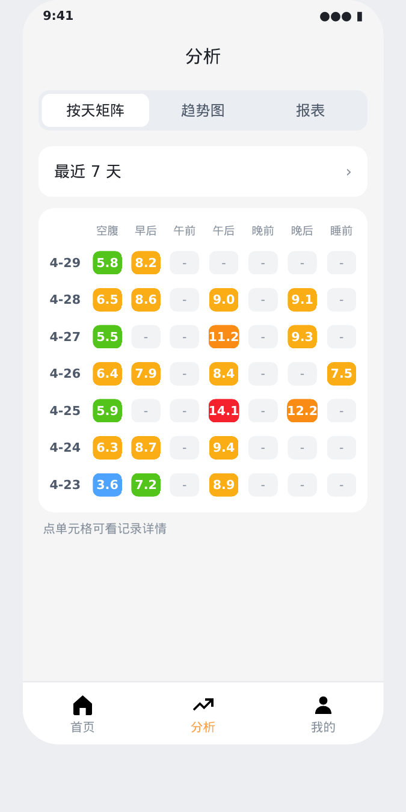

**页面职责**：以"日期 × 时段"二维表查看历史，快速发现某天某时段是否漏测。

布局：
- 顶部：周/月切换 + 日期选择器
- 主体：纵轴日期（最近 7/30 天），横轴时段（8 个），单元格显示血糖值并按颜色染色
- 空单元格灰色显示"-"
- 点击单元格 → 跳转记录详情

### 6.5 P05 分析-趋势图

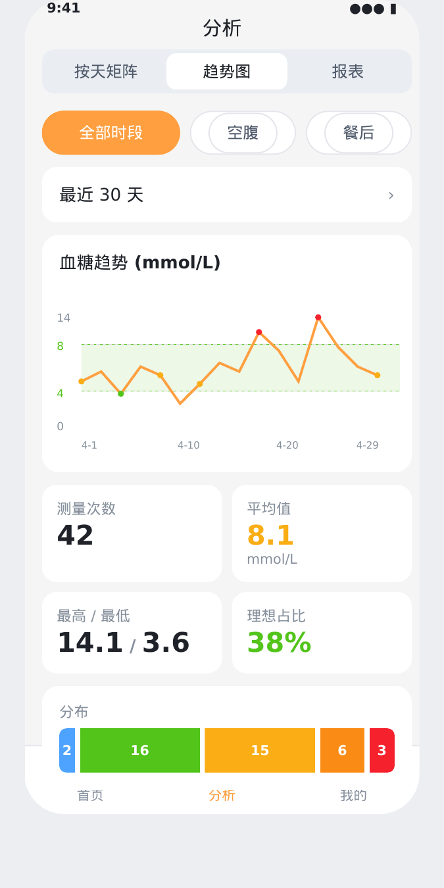

**页面职责**：观察某段时间内某时段的血糖趋势。

筛选项：
- 时段筛选（默认"全部"，可选单时段如"空腹"）
- 时间范围（最近 7 天 / 30 天 / 自定义起止）

主体：折线图
- X 轴：日期
- Y 轴：血糖值（mmol/L）
- 阴影区：理想区间（绿色淡背景）
- 警戒线：偏低/过高横线

下方显示统计卡片：测量次数 / 平均值 / 最高 / 最低 / 各档分布（偏低/理想/一般/偏高/过高）。

### 6.6 P06 分析-周期报表

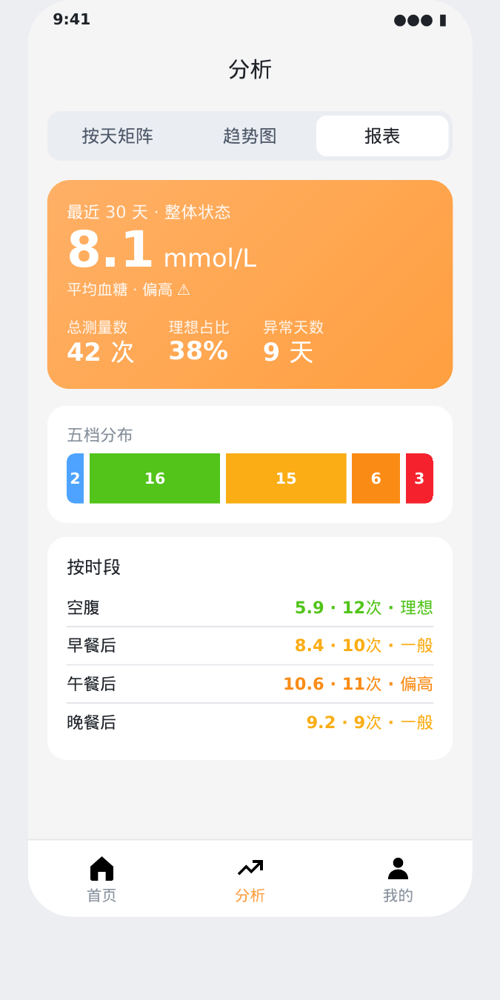

**页面职责**：把一段时间的整体情况浓缩到一屏，可截图发给医生。

字段：
- 时间范围（默认最近 30 天）
- 总测量数
- 平均血糖
- 整体状态判断（颜色卡片）
- 五档分布柱状图
- 按时段分组统计：每个时段的平均值、次数、状态

不做：HbA1c 预估值（首版砍掉，避免给非医学背景的家人误导）。

### 6.7 P07 我的

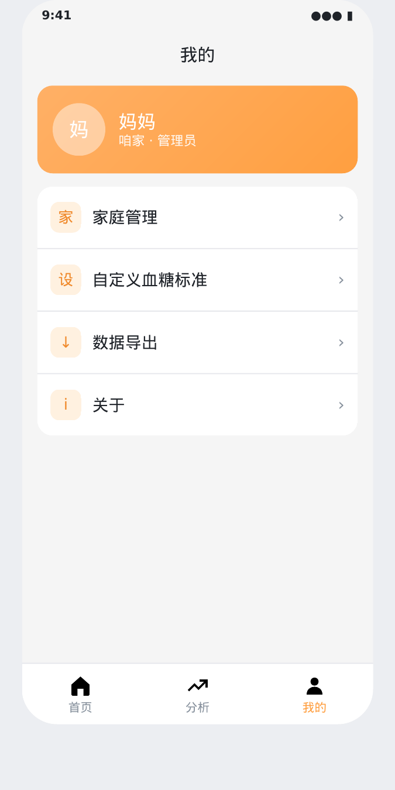

简单列表入口：家庭管理 / 自定义血糖标准 / 数据导出 / 关于。
顶部显示当前用户头像、昵称、所属家庭名。

### 6.8 P08 家庭管理（管理员视图）

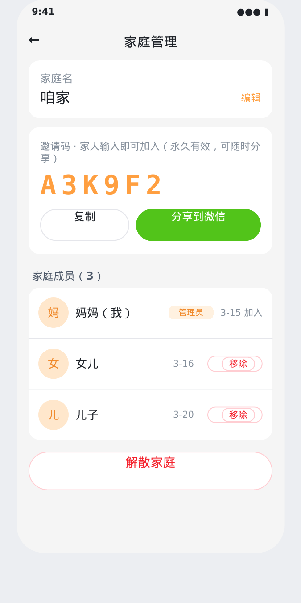

可见信息：
- 家庭名 + 编辑按钮
- 6 位邀请码 + "**复制**"按钮 + "**分享给微信好友**"按钮（拉起微信原生分享面板，把邀请码作为文字消息或卡片发给家人；邀请码恒久有效，管理员随时可在此页拿到）
- 家庭成员列表，每个成员显示头像、昵称、加入时间、角色标签
- 每个成员（除自己外）右侧显示"移除"按钮
- 底部"解散家庭"按钮（红色，二次确认）

### 6.8b P08b 家庭管理（成员视图）

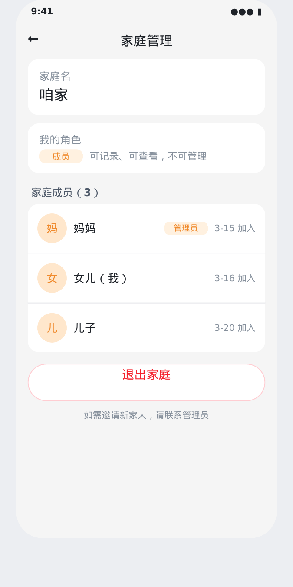

可见信息：
- 家庭名（只读，无编辑按钮）
- **不显示邀请码**（管理职能）
- 家庭成员列表，仅展示头像、昵称、加入时间、角色标签
- **不显示**移除按钮
- 底部"退出家庭"按钮（二次确认）

### 6.9 P09 加入家庭

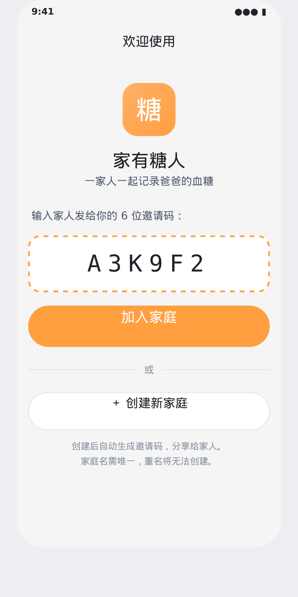

首次登录的用户必须先选择"创建家庭"或"加入已有家庭"。
- 创建家庭：输入家庭名 → 校验唯一性（同名直接报错"该家庭名已被使用，请换一个"）→ 通过后自动生成邀请码 → 进入首页 → 自己成为管理员
- 加入家庭：输入 6 位邀请码 → 校验通过 → 进入首页 → 自己成为成员

### 6.10 P10 自定义血糖标准

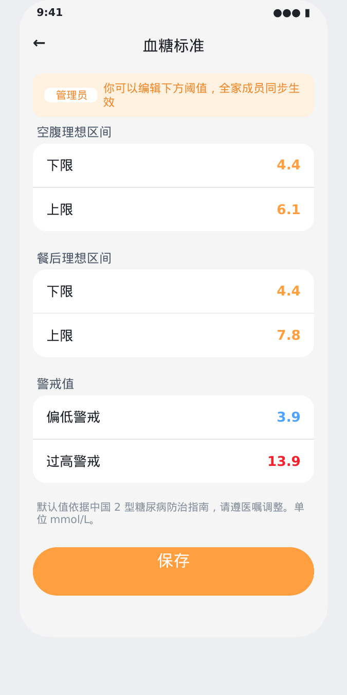

仅管理员可编辑，成员进入此页面所有字段均为只读、保存按钮隐藏。所有家庭成员看到的判定标准一致。

字段：
- 空腹理想区间下限（默认 4.4）
- 空腹理想区间上限（默认 6.1）
- 餐后理想区间下限（默认 4.4）
- 餐后理想区间上限（默认 7.8）
- 偏低警戒值（默认 3.9，低于此为"偏低"红色）
- 过高警戒值（默认 13.9，高于此为"过高"深红）

### 6.11 P11 数据导出

选择时间范围 → 点击"生成 CSV" → 微信原生分享 / 复制链接。
CSV 字段：日期 / 时间 / 时段 / 血糖值 / 单位 / 状态 / 记录人 / 备注。

### 6.12 P12 关于

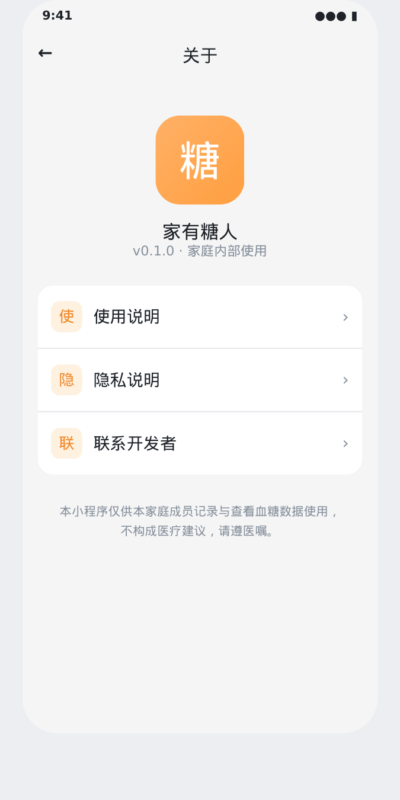

版本号、开发说明、联系方式。无业务逻辑。

## 7. 颜色分级规则

血糖值会被分到 5 档，每档对应一个颜色：

| 档位 | 颜色 | 含义 | 默认判定（mmol/L） |
| --- | --- | --- | --- |
| 偏低 | 蓝色 `#4DA3FF` | 低血糖警戒 | 低于"偏低警戒值"（默认 3.9） |
| 理想 | 绿色 `#52C41A` | 在理想区间内 | 在"理想下限~上限"之间（空腹 4.4-6.1，餐后 4.4-7.8） |
| 一般 | 黄色 `#FAAD14` | 略偏高但可接受 | 在"理想上限~过高警戒值"之间 |
| 偏高 | 橙色 `#FA8C16` | 偏高 | 越接近警戒值偏橙 |
| 过高 | 红色 `#F5222D` | 高血糖警戒 | 高于"过高警戒值"（默认 13.9） |

判定时按时段区分：空腹/餐前/睡前用空腹标准，餐后用餐后标准。

## 8. 关键业务流程

### 8.1 首次使用流程

1. 用户在微信里打开小程序。
2. 第一次进入会弹"创建家庭 / 加入家庭"二选一。
3. 创建者填家庭名拿到邀请码；成员填邀请码加入。
4. 完成后落到首页。

### 8.2 家庭协作流程

1. 创建者建好家庭，拿到 6 位邀请码。
2. 创建者把邀请码复制发到家人微信群。
3. 家人打开小程序，进入"加入家庭"页，输入邀请码，加入完成。
4. 之后所有人在家里任何时间记录的血糖，全员实时可见。

### 8.3 日常记录流程

1. 任何家庭成员用血糖仪给爸爸量血糖。
2. 打开小程序首页，点底部"+ 记一次血糖"。
3. 输入数值、选时段、改时间（如有需要）、留备注。
4. 保存。新记录立刻出现在全员的首页时间流上，带"谁记的"标记。

### 8.4 看医生前导出流程

1. 进我的 → 数据导出。
2. 选最近 30/90 天。
3. 生成 CSV，分享给医生或自己存档。

## 9. 视觉与交互特征

- **主色**：温暖橙 `#FF9F40`（与原产品一致，糖尿病管理类常用色）
- **状态色**：偏低 `#4DA3FF` 蓝、理想 `#52C41A` 绿、一般 `#FAAD14` 黄、偏高 `#FA8C16` 橙、过高 `#F5222D` 红
- **字号**：正文 32rpx 起步（约 16px），数值 80rpx，按钮文字 36rpx
- **按钮**：高度至少 96rpx（48px），圆角 16rpx
- **行间距**：列表项最小高度 160rpx，给老人手指留点击余量
- **背景**：浅灰 `#F5F5F5`，卡片白底
- **不用**：动画过渡、深色模式、抽屉菜单等增加学习成本的交互

## 10. 非目标（明确不做的事）

- 不做用药记录的结构化字段（仅备注）
- 不做食物图片识别 / 卡路里计算
- 不做血压、血脂等其他健康指标
- 不做 AI 问询
- 不做提醒推送（首版砍掉）
- 不做多家庭切换（一个微信账号同一时间只属于一个家庭）
- 不做 PC 端管理后台

## 11. 后续阶段规划（仅记录，不做）

如果首版跑顺，后续可考虑增量加入：
- **第二阶段**：餐后测糖订阅消息提醒、健康记录数据备份到云盘、AI 录入支持跨日 / 多条批量
- **第三阶段**：用药结构化记录、家庭医生联系入口、多语言支持、AI 异常趋势主动提醒

## 12. 验收标准

首版上线后，满足以下条件即认为闭环可用：
- 三个家庭成员能各自加入同一家庭。
- 任意成员录入的血糖记录在 5 秒内出现在其他成员的首页。
- 按天矩阵能正确按颜色显示最近 30 天每天每时段的状态。
- 趋势图能在选择"空腹+最近 30 天"时显示正确的折线和统计。
- 报表能正确计算平均血糖与五档分布。
- CSV 导出可在微信里分享出去并用 Excel 打开。
- 管理员能在 P08 随时复制或通过微信分享邀请码。
- 输入"早上 9:20 空腹血糖 11.1，吃了二甲双胍" 能正确识别四个字段（值/时段/时间/备注），用户确认后入库。
- 测量时间选择器步进为 5 分钟，无法选到 09:23 这种刻度。

## 13. 已确认决策

以下问题已与用户对齐：

1. **家庭名**：不允许同名，创建时做唯一性校验，重名直接报错。
2. **HbA1c 估算**：不做（避免误导非医学背景的家人）。
3. **邀请码失效机制**：邀请码恒久有效，无刷新功能；管理员可在 P08 随时复制或微信分享邀请码。
4. **导出格式**：仅 CSV，不做 PDF。
5. **角色权限**：创建者 = 管理员（邀请、删除成员、改家庭设置、解散）；成员只能记录、查看、退出。
6. **测量时间精度**：按 5 分钟刻度选择，不做到分钟级精度（人工记录无法做到那么准）。
7. **AI 录入**：首版即包含。文字+语音两种输入，自动识别 4 字段，用户必须确认后才入库；不支持多条/跨日，限于当天单条。

---

PRD 已敲定，可基于此进入开发阶段。
