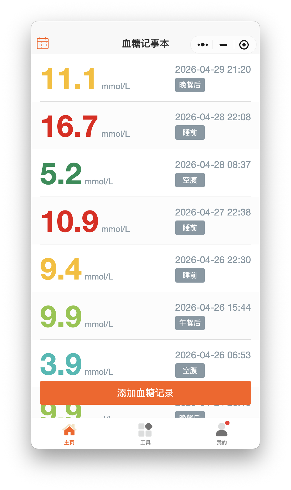
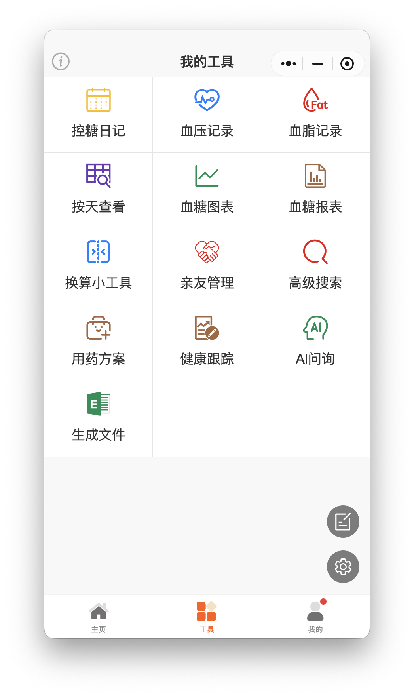
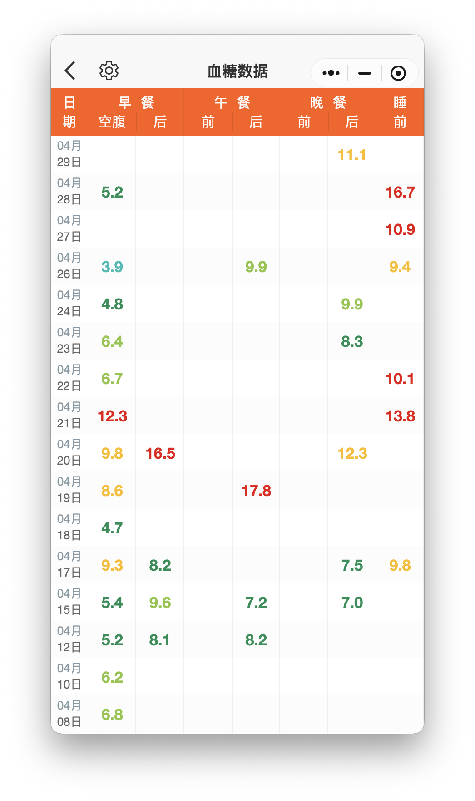
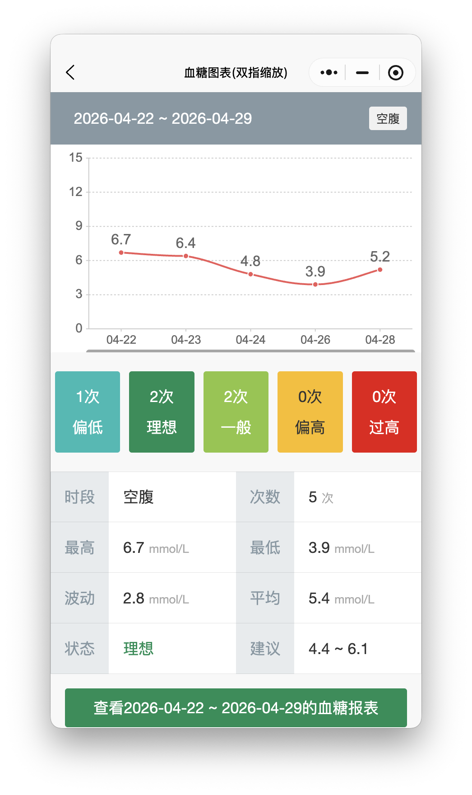
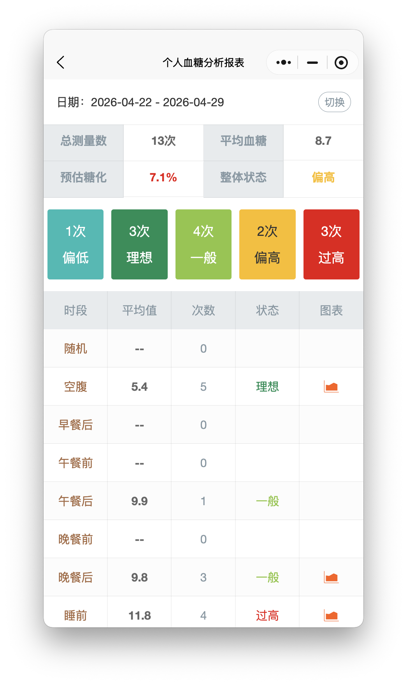
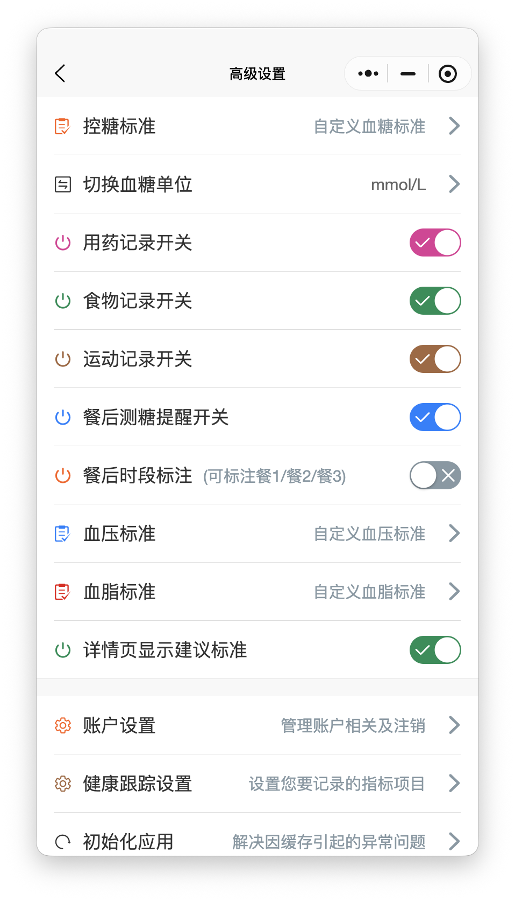

# 血糖记事本小程序需求说明

## 1. 文档概述

- 文档目的：基于对微信小程序“血糖记事本”的实际界面观察，梳理其业务功能、页面结构与关键流程，形成可用于竞品分析、需求拆解和复刻规划的说明书。
- 调研方式：通过本机微信小程序实际浏览与截图，按首页、工具页、我的页及主要二级页面逐项确认。
- 调研边界：本次仅做只读观察，不新增、不修改、不删除用户健康数据；涉及图表和报表的内容以当前账户已有数据为样本。
- 结论性质：本文属于“现状需求梳理”，描述的是当前产品已呈现能力，不代表完整后台规则或隐藏功能。

## 2. 产品定位判断

“血糖记事本”并非单一血糖记账工具，而是面向糖尿病或高血糖人群的轻量化慢病管理小程序。其能力主线可以归纳为：

`血糖记录 -> 趋势分析 -> 饮食/用药/运动联动 -> 家属协同 -> 导出与设置`

从页面命名和功能组合看，产品明显兼顾以下三类使用场景：

- 个人日常血糖自我管理
- 家庭成员代管或照护
- 基于历史记录的阶段性分析与导出

## 3. 信息架构

### 3.1 一级导航

- 首页：血糖记录流、快速新增
- 工具：分析、扩展记录、搜索、导出、AI、亲友管理
- 我的：个人资料、分类维护、公告反馈、系统设置

### 3.2 工具页能力地图

- 控糖日记
- 血压记录
- 血脂记录
- 按天查看
- 血糖图表
- 血糖报表
- 换算小工具
- 亲友管理
- 高级搜索
- 用药方案
- 健康跟踪
- AI问询
- 生成文件

## 4. 核心页面与截图

### 4.1 首页：血糖记录流与快速新增

页面职责：

- 按时间倒序展示血糖记录
- 以大数字形式突出血糖值
- 展示记录时间与时段标签
- 通过颜色区分数值状态
- 提供“添加血糖记录”主操作入口

可见功能点：

- 血糖记录列表
- 时段标签：空腹、午餐后、晚餐后、睡前等
- 数值颜色分级显示
- 快速新增血糖记录

### 4.2 工具页：功能聚合入口

页面职责：

- 汇总所有分析、扩展记录、协同与辅助功能
- 作为除首页外的主要导航中心

可见功能点：

- 控糖日记
- 血压记录
- 血脂记录
- 按天查看
- 血糖图表
- 血糖报表
- 换算小工具
- 亲友管理
- 高级搜索
- 用药方案
- 健康跟踪
- AI问询
- 生成文件

### 4.3 添加血糖记录

页面职责：

- 输入血糖值
- 按步骤完成新增记录

当前可确认能力：

- 输入血糖值
- 显示当前血糖单位
- 通过“下一步”进入后续记录步骤

说明：

- 由于本次不修改用户健康数据，未继续提交后续步骤。
- 结合首页现有记录标签判断，新增流程后续大概率包含时段选择与时间确认。

### 4.4 按天查看：矩阵式历史回顾

页面职责：

- 以“日期 x 时段”的二维表方式查看历史数据
- 用于快速发现某天某时段是否已记录及异常分布

可见功能点：

- 日期纵向排列
- 时段横向排列：空腹、早餐后、午餐前、午餐后、晚餐前、晚餐后、睡前
- 数值颜色分层显示
- 连续多日数据对比

### 4.5 血糖图表：趋势分析

页面职责：

- 按日期范围和时段标签生成折线图
- 对某一类时段的血糖变化进行趋势分析

当前已确认能力：

- 选择区间类型
- 选择时段标签
- 选择开始日期和截止日期
- 生成血糖图表
- 展示次数分布：偏低、理想、一般、偏高、过高
- 输出统计结果：最高、最低、平均、波动、建议区间、状态
- 支持进一步查看对应报表

### 4.6 个人血糖分析报表：统计报表

页面职责：

- 汇总指定时间范围内的血糖总体情况
- 以报表方式输出整体状态和各时段状态

当前已确认能力：

- 显示统计日期范围
- 总测量数统计
- 平均血糖统计
- 预估糖化指标
- 整体状态判断
- 五档分布统计：偏低、理想、一般、偏高、过高
- 按时段展示平均值、次数、状态
- 提供切换维度或区间的入口

### 4.7 我的页：配置与运营入口

页面职责：

- 承载用户信息、分类维护、公告反馈和高级设置

可见功能点：

- 用户昵称与 ID
- 提交反馈或建议
- 日常药品类型维护
- 日常食物类型维护
- 日常运动类型维护
- 通知公告
- 关于我们
- 赞赏或联系开发者
- 高级设置
- 关怀模式开关

### 4.8 高级设置：规则与能力开关

页面职责：

- 配置血糖及相关健康管理规则
- 控制记录能力的显隐与提醒开关

当前已确认能力：

- 自定义血糖标准
- 切换血糖单位
- 用药记录开关
- 食物记录开关
- 运动记录开关
- 餐后测糖提醒开关
- 餐后时段标注开关
- 自定义血压标准
- 自定义血脂标准
- 详情页显示建议标准开关
- 账户设置
- 健康跟踪设置
- 初始化应用

## 5. 模块级功能清单

| 模块 | 页面/入口 | 功能点 | 业务目的 | 优先级判断 |
| --- | --- | --- | --- | --- |
| 血糖记录 | 首页 | 查看血糖记录流 | 建立日常记录主视图 | P0 |
| 血糖记录 | 首页 | 颜色分级展示血糖值 | 快速识别异常数据 | P0 |
| 血糖记录 | 首页 | 按时段标签展示记录 | 支撑分时段管理 | P0 |
| 血糖记录 | 添加血糖记录 | 录入血糖值并进入下一步 | 完成数据沉淀 | P0 |
| 数据分析 | 按天查看 | 以矩阵方式查看历史血糖 | 快速对比不同日期与时段 | P0 |
| 数据分析 | 血糖图表 | 按时间范围和时段生成趋势图 | 观察阶段变化 | P0 |
| 数据分析 | 血糖报表 | 输出周期性统计结果 | 支撑总结与复盘 | P0 |
| 多指标管理 | 工具页 | 血压记录 | 扩展慢病指标管理 | P1 |
| 多指标管理 | 工具页 | 血脂记录 | 扩展慢病指标管理 | P1 |
| 健康干预 | 工具页/设置 | 用药方案、用药记录 | 建立用药关联管理 | P1 |
| 健康干预 | 设置 | 食物记录、运动记录开关 | 建立行为因素关联 | P1 |
| 健康干预 | 设置 | 餐后测糖提醒 | 提高记录及时性 | P1 |
| 搜索查询 | 工具页 | 高级搜索 | 提高历史记录检索效率 | P1 |
| 协同能力 | 工具页 | 亲友管理 | 支撑家庭照护协同 | P1 |
| 智能辅助 | 工具页 | AI问询 | 提供咨询式辅助能力 | P2 |
| 导出能力 | 工具页 | 生成文件 | 导出或分享记录分析结果 | P1 |
| 配置中心 | 高级设置 | 自定义血糖/血压/血脂标准 | 适配个体化目标 | P0 |
| 配置中心 | 高级设置 | 单位切换 | 适配不同使用习惯 | P1 |
| 配置中心 | 我的页/设置 | 账户、公告、反馈、初始化应用 | 保障产品运维与支持 | P1 |

优先级说明：

- P0：构成产品核心闭环，没有则产品价值不成立
- P1：增强型能力，明显提升完整度和留存
- P2：可做差异化补充，但不是首版闭环前提

## 6. 关键业务流程

### 6.1 日常记录流程

1. 用户进入首页查看最近血糖记录。
2. 点击“添加血糖记录”进入录入页。
3. 输入血糖值，并进入下一步完成时段/时间等补充信息。
4. 新记录回流到首页时间流，并在后续分析模块中可见。

### 6.2 趋势分析流程

1. 用户在工具页进入“血糖图表”。
2. 选择区间类型、时段标签、起止日期。
3. 生成图表后查看折线趋势、状态分布和统计结果。
4. 如需更完整分析，可继续进入血糖报表。

### 6.3 报表复盘流程

1. 用户进入“血糖报表”或从图表页进入报表。
2. 系统按时间范围输出总测量数、平均值、预估糖化和整体状态。
3. 用户继续按时段查看平均值、次数和状态。

### 6.4 家属照护流程

1. 使用者通过“亲友管理”建立协同关系。
2. 在“关怀模式”下优化面向老人/家属的使用体验。
3. 家属可围绕记录、分析和提醒进行辅助管理。

## 7. 页面规则与交互特征

### 7.1 可见交互规则

- 首页强调“大数字 + 强颜色 + 标签”的低学习成本展示方式。
- 工具页采用九宫格/宫格导航，便于快速进入细分功能。
- 血糖分析类页面普遍围绕“日期范围 + 时段标签”建立。
- 报表页统一使用颜色状态卡片表达健康等级。
- 设置页采用开关与标准配置混合方式，兼顾普通用户与进阶用户。

### 7.2 视觉与体验特征

- 主色偏橙色，用于强调主操作和标题区域。
- 风险颜色直观：蓝绿偏低/理想，黄偏高，红过高。
- 页面结构明显偏移动端和中老年友好，字号较大、入口直白。

## 8. 需求复刻建议

如果要做一版最小可用产品，建议按以下顺序实现：

### 8.1 第一阶段：核心闭环

- 血糖记录列表
- 新增血糖记录
- 时段标签
- 异常颜色分层
- 按天查看
- 血糖图表
- 血糖报表
- 控糖标准配置

### 8.2 第二阶段：完整慢病管理

- 血压记录
- 血脂记录
- 用药方案与记录
- 饮食记录
- 运动记录
- 高级搜索
- 生成文件

### 8.3 第三阶段：差异化与协同

- 亲友管理
- 关怀模式
- 健康跟踪
- AI问询

## 9. 未确认项与后续建议

以下内容在本次观察中存在合理推断，但未做深入操作验证：

- “添加血糖记录”后续步骤的完整字段结构
- “生成文件”的具体导出格式与分享方式
- “AI问询”的问答边界与是否依赖外部模型服务
- “亲友管理”的协同权限模型
- “健康跟踪”的具体跟踪指标与展示方式
- 血压记录、血脂记录页面的录入字段明细

建议后续如需输出更完整的 PRD 或复刻方案，再补做两类工作：

1. 二级页面深挖：逐项进入血压、血脂、用药、亲友、AI、导出等页面继续补字段与流程。
2. 流程级验证：在隔离测试账号中完整走一次新增、编辑、搜索、导出和协同流程。

## 10. 附件

- 截图目录：`docs/assets/血糖记事本/`
- 当前文档：`docs/血糖记事本小程序需求说明.md`
